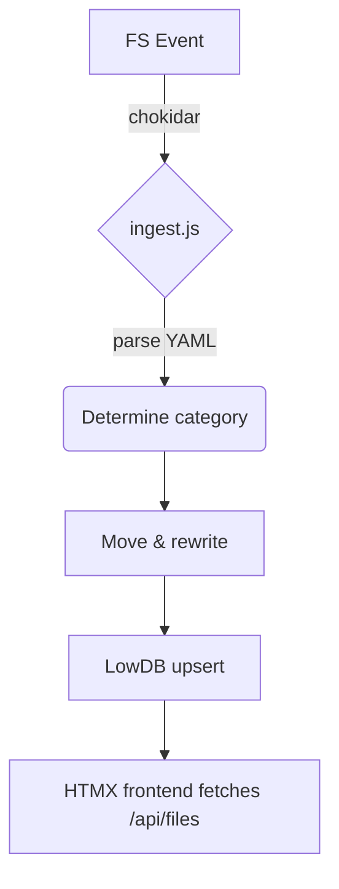

# Architecture Specification

Version: 0.1 · 2025-07-16

---

## 1 · Tech Stack

| Concern          | Choice                | Notes                           |
|------------------|-----------------------|---------------------------------|
| HTTP server      | Express 4            | Lightweight, middleware rich    |
| Realtime UI      | HTMX 1.9             | Incremental HTML, no bundler    |
| Data store       | LowDB 3 (JSON file)  | Good enough ≤ 10 k records      |
| File watching    | Chokidar 3           | Cross-platform FS events        |
| Markdown editor  | SimpleMDE            | Single-file WYSIWYG             |
| Styling          | Plain CSS (`web/style.css`) | Designer-friendly             |
| Node version     | 20 LTS               | Pinned via `.nvmrc`             |

---

## 2 · Directory Layout

```
src/
├─ watcher/           # chokidar + ingest pipeline
│   ├─ ingest.js      # core FSM
│   └─ filingRules.js # manifest loader & classifier stub
├─ api/               # Express routers
│   ├─ files.js       # /api/files  /api/file/:id
│   └─ intake.js      # /api/intake …
├─ web/               # Static assets (served as-is)
│   ├─ index.html
│   ├─ style.css
│   ├─ js/
│   │   ├─ htmx.min.js
│   │   └─ editor-init.js
│   └─ icons/
└─ server.js          # bootstraps Express & watcher
```

> Agents MUST adhere to this structure; tests rely on these paths.

---

## 3 · Watched-Paths Configuration

Watcher reads **`watcher.paths.json`** (generated by copying the sample):

```jsonc
[
  "/Users/you/Documents/project1",
  "/Users/you/Repos/notes"
]
```

Rules:
* Absolute paths only.
* Duplicates ignored.
* Runtime changes: API endpoints (see § 5) update the JSON and restart the watcher.

### CLI shortcut

```bash
npm run add-path /absolute/dir
npm run remove-path /absolute/dir
```
(Scripts call the same internal helper used by the API.)

---

## 4 · High-Level Flow



---

## 5 · HTTP Endpoints (superset)

| Route | Method | Purpose |
|-------|--------|---------|
| `/api/files` | GET | List files, filter via `tag=`, `status=` |
| `/api/file/:id` | GET | Render HTML (cards, markdown) |
| `/api/file/:id/raw` | GET | Raw Markdown for editor |
| `/api/file/:id` | PUT | Save edited Markdown |
| `/api/new` | POST | Create new file (modal form) |
| `/api/intake` | GET | List `needsAttention` items |
| `/api/intake/:id/accept` | POST | Mark triaged |
| `/api/intake/:id/archive` | POST | Archive file |
| `/api/paths` | GET | Return array in `watcher.paths.json` |
| `/api/paths` | POST | `{ path }` Add & restart watcher |
| `/api/paths` | DELETE | `{ path }` Remove & restart |

Front-end HTMX calls supply/swap fragments; no full-page reloads.

---

## 6 · Restart Strategy for Watcher

Watcher runs as a Node child process forked from `server.js`.  When `/api/paths` mutates the JSON, the child is killed and re-spawned with the new set of paths (debounced 500 ms).

---

## 7 · OpenAI / LLM Integration

Env var `OPENAI_API_KEY` (or `AI_PROVIDER=none` to disable).  All calls respect the rate limits & debounce values stated in `INTAKE_FOLDER_HANDLING_SPEC.md`.

---

End of spec. 